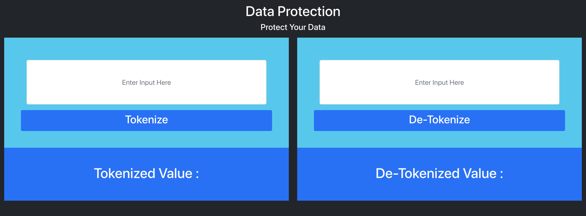
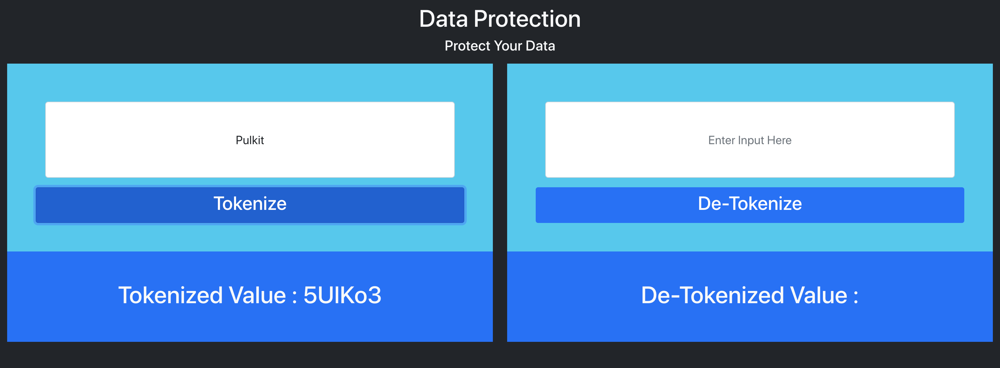
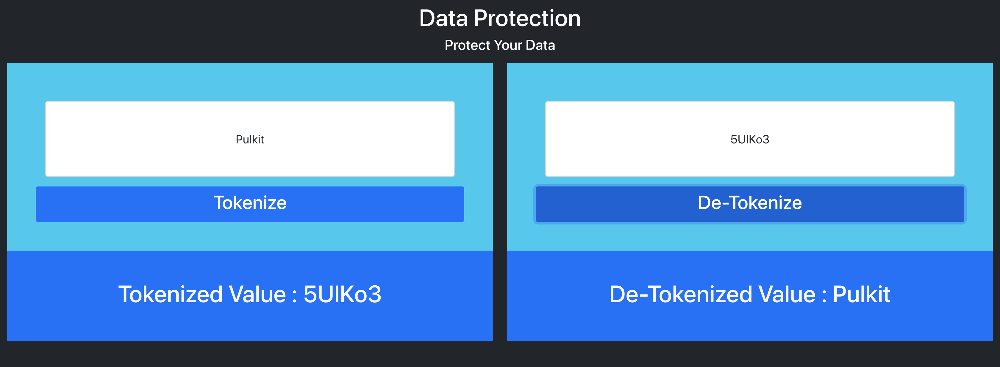
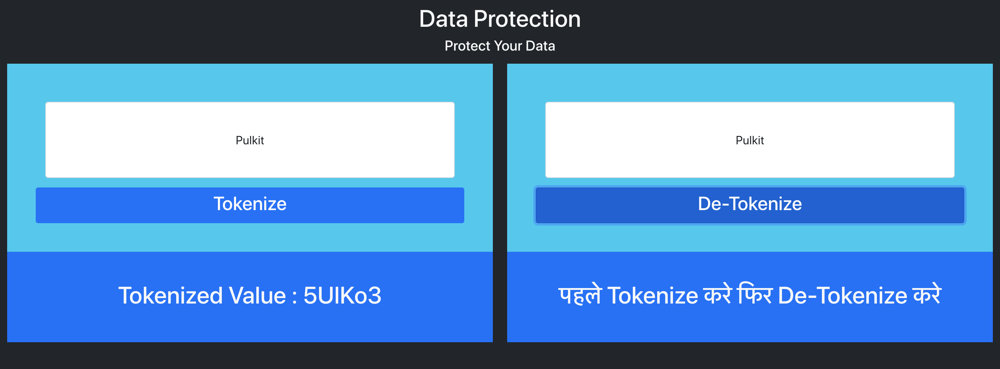

# Data-Protection-UI
React App to Protect Data using Tokenization

## Pre-Requisite
Run [Data-Protection-APIs](https://github.com/pulkits1998/data-protection-apis) in docker.

## UI Look
### Initial Screen


### Tokenize


### DeTokenize


### DeTokenize With Wrong Input


## Local Setup
```
docker-compose up
```

Open [Localhost](http://localhost:4000) in your browser and enjoy.

## Note
* Maximum length of text it can tokenize is 100 characters.
